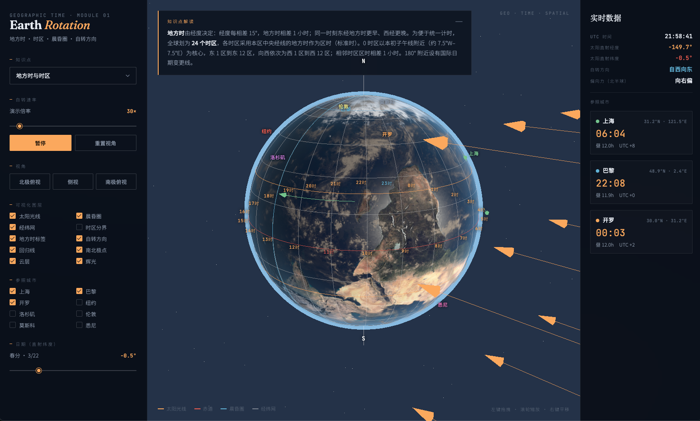
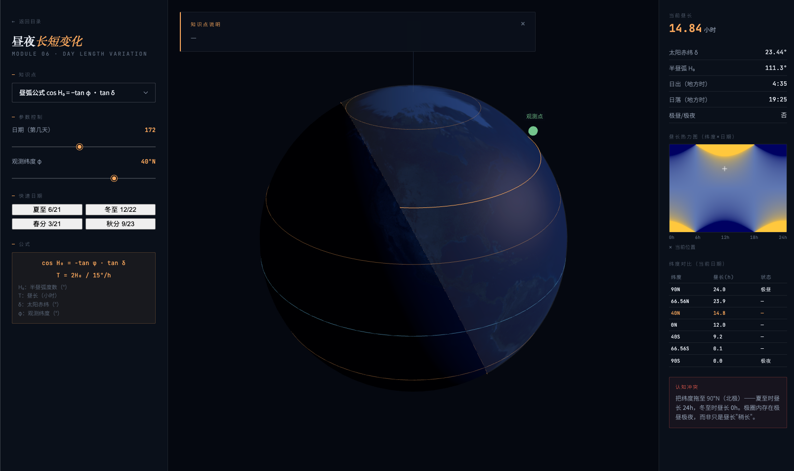
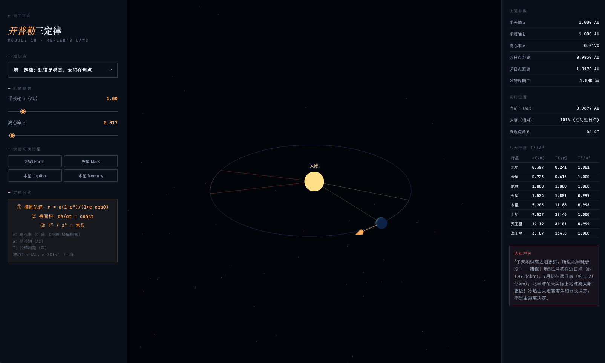
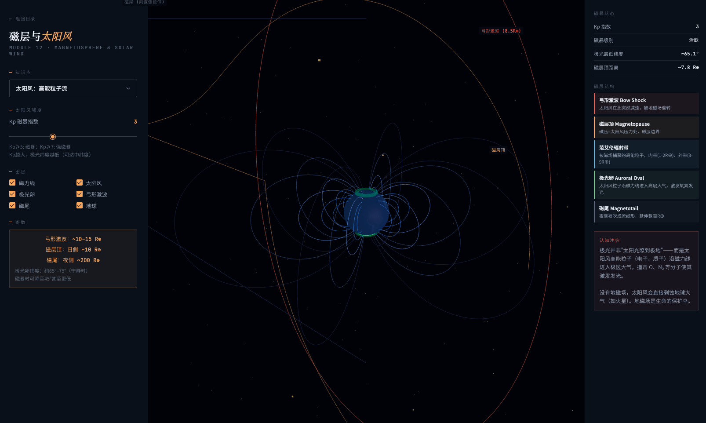

<div align="center">

# 地理与天文 · 3D 交互教学工具集

**为中国地理和天文教师打造的开源课堂演示工具**

<br>

[**🇨🇳 中文**](#-项目介绍) · [**🇬🇧 English**](#-english-overview)

<br>

[](https://github.com/edu-ai-builders/geography-viz-kit)
[](#适用对象)
[](#快速开始)
[](LICENSE)

</div>

---

## 🇨🇳 项目介绍

地理课最大的难点不是"背不下来"，而是**脑子里没有画面**。

这套工具用 3D 交互可视化，把课本里最抽象的概念变成可以拖动、调节、实时观察的动画。涵盖**人教版高中地理必修一/二**到**大学天文学**的核心内容，共 12 个独立模块。

**打开浏览器即可使用，无需安装任何软件。**

<br>

### 工具预览

<table>
  <tr>
    <td align="center" width="50%">
      
      <br><sub><b>模块导航页 — 12 个模块一览</b></sub>
    </td>
    <td align="center" width="50%">
      
      <br><sub><b>01 · 地球自转 — 实时光照、时区、晨昏线</b></sub>
    </td>
  </tr>
  <tr>
    <td align="center" width="50%">
      
      <br><sub><b>06 · 昼夜长短 — 全年全纬度热力图</b></sub>
    </td>
    <td align="center" width="50%">
      
      <br><sub><b>10 · 开普勒三定律 — 等面积扫描实时可见</b></sub>
    </td>
  </tr>
  <tr>
    <td align="center" colspan="2">
      
      <br><sub><b>12 · 磁层与太阳风 — 偶极子磁力线、极光、Kp指数</b></sub>
    </td>
  </tr>
</table>

<br>

### 模块列表

> 点击文件名可直接下载并在浏览器打开

| 阶段 | 编号 | 文件 | 主题 | 适用年级 |
|------|------|------|------|---------|
| **Phase 1** 地球运动 | 01 | `01-earth-rotation.html` | 地球自转 · 地方时 · 时区 · 晨昏线 | 初中七年级 / 高中必修一 |
| | 02 | `02-earth-revolution.html` | 地球公转 · 黄赤交角 · 季节成因 | 高中必修一 |
| | 03 | `03-solar-altitude.html` | 正午太阳高度角 H = 90° − \|φ − δ\| | 高中必修一 |
| | 04 | `04-shadow.html` | 影子方向与长度 L = h / tan(H) | 高中必修一 |
| | 05 | `05-solar-path.html` | 太阳视运动路径 · 天球穹顶 | 高中必修一 |
| **Phase 2** 大气海洋 | 06 | `06-day-length.html` | 昼夜长短变化 · 全年热力图 | 高中必修一 |
| | 07 | `07-atmospheric-circulation.html` | 气压带风带 · 科里奥利力 · 季节移动 | 高中必修一 |
| | 08 | `08-ocean-currents.html` | 世界洋流 · 动画粒子流 · 渔场标注 | 高中必修二 |
| **Phase 3** 天文宇宙 | 09 | `09-celestial-coordinates.html` | 赤道坐标系 · 赤经赤纬 · 黄道面 | 大学天文 / 竞赛 |
| | 10 | `10-kepler-orbits.html` | 开普勒三定律 · 等面积扫描 · T²∝a³ | 大学天文 / 竞赛 |
| | 11 | `11-solar-system-scale.html` | 太阳系比例模型 · 对数/线性切换 | 初中 / 大学 |
| | 12 | `12-magnetosphere.html` | 磁层与太阳风 · 极光 · Kp指数 | 大学 / 竞赛 |

<br>

### 适用对象

| 使用者 | 推荐用法 |
|--------|---------|
| **高中地理老师** | 课堂演示替代黑板箭头图；用认知冲突钩子引导学生讨论 |
| **初中地理老师** | 01（时区）、11（太阳系比例）可直接用于七年级课程 |
| **备考学生** | 把高频易错考点拖到极限值，亲眼看到误区在哪里 |
| **天文/竞赛辅导** | 09–12 模块覆盖竞赛天文专题 |

<br>

### 教学设计亮点

每个模块都有一个**"认知冲突触发器"**——一个让学生得到意外结果的操作，逼迫他们重建正确认知：

- **模块02**：把黄赤交角拖到 **0°** → 直射纬度变成水平线，四季消失 → 打破"距离决定温度"的误区
- **模块06**：极昼极夜边界在热力图上清晰可见 → 学生自己发现规律，而不是被告知
- **模块10**：近日点/远日点速度差异肉眼可见 → 开普勒等面积定律从抽象变具体
- **模块12**：调高 Kp 指数 → 极光圈向低纬度扩展 → 理解磁暴与极光的真实关联

完整知识体系与每个模块的认知冲突设计见 [`知识体系.md`](知识体系.md)。

<br>

### 每个模块的界面结构

```
┌──────────────────┬─────────────────────────┬──────────────────┐
│   左侧控制面板   │     中央 3D 交互画布     │   右侧数据面板   │
│                  │                         │                  │
│  · 知识点说明    │  · 可拖动旋转、缩放      │  · 实时数值读出  │
│  · 图层开关      │  · 滑杆驱动动画          │  · 同步更新      │
│  · 参数滑杆      │  · NASA 纹理真实渲染     │  · 公式代入显示  │
└──────────────────┴─────────────────────────┴──────────────────┘
```

同一个概念同时用**空间画面**和**精确数值**两种方式呈现（双重编码），帮助不同学习风格的学生都能建立正确认知。

<br>

### 快速开始

**方式一：直接下载打开（推荐）**

1. 点击右上角绿色 **Code** 按钮 → **Download ZIP**
2. 解压后，在浏览器打开 `index.html`
3. 点击任意模块卡片进入

**方式二：命令行**

```bash
git clone https://github.com/edu-ai-builders/geography-viz-kit.git
cd geography-viz-kit
open index.html   # macOS
# 或双击 index.html 文件
```

**方式三：若浏览器有跨域限制**

```bash
python3 -m http.server 8080
# 然后访问 http://localhost:8080
```

> 首次打开时，云层贴图（5MB）需要几秒加载——地球会立即显示，纹理逐渐升级，不会卡住。

<br>

---

## 🇬🇧 English Overview

[↑ 返回中文](#-项目介绍)

A collection of 12 interactive 3D visualizations for Chinese K-12 and university geography and astronomy education. Each module is a single self-contained HTML file — open directly in any modern browser, no installation required.

### Design Principles

Every module follows a three-panel layout (controls / 3D canvas / live data readout) and includes:
- A **知识点 dropdown** that changes the in-canvas explanation
- **Layer toggles** to show/hide individual visual elements
- **Dual-coded readout** — every concept shown both spatially and numerically, in sync every frame
- **A productive struggle hook** — a slider whose extreme value creates a deliberate cognitive conflict that forces students to reconstruct their understanding

### Photorealistic Earth

Earth-showing modules progressively load five texture layers from CDN (Earth renders immediately with a placeholder; layers upgrade as they arrive): day map, specular ocean mask, normal map (terrain relief), NASA night lights (city glow), and a 5 MB cloud layer.

### Tech Stack

- **Three.js r160** via importmap — no bundler, no npm
- **UnrealBloomPass** post-processing bloom on all modules
- **CSS2DRenderer** for HTML label overlays (unaffected by WebGL)
- ~20–55 KB per file

### Quick Start

```bash
git clone https://github.com/edu-ai-builders/geography-viz-kit.git
cd geography-viz-kit
open index.html
```

See [`CLAUDE.md`](CLAUDE.md) for full architecture notes, coordinate conventions, and the shared Earth render block pattern.

---

<div align="center">
<sub>MIT License · Open to use in classrooms · Contributions welcome</sub>
</div>
